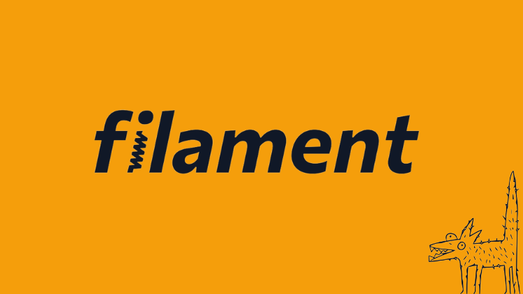
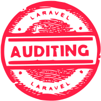

# ICTServe (iServe) – Sistem Pengurusan Perkhidmatan ICT Berpaksikan Rakyat (MYDS & MyGovEA)

ICTServe (iServe) ialah sistem bersepadu untuk pengurusan pinjaman peralatan ICT dan aduan kerosakan ICT di Kementerian Pelancongan, Seni dan Budaya Malaysia (MOTAC). Sistem ini menggabungkan dua sistem warisan kepada satu platform moden berasaskan Laravel 12, dibangunkan mengikut prinsip Malaysia Government Design System (MYDS) dan prinsip reka bentuk MyGovEA.

---

| [](https://design.digital.gov.my/) | [](https://www.digital.gov.my/) | [](https://filamentphp.com/) |
|:--:|:--:|:--:|
| [MYDS](https://design.digital.gov.my/) | [Kementerian Digital](https://www.digital.gov.my/) | [Filament](https://filamentphp.com/) |

---

## Objektif & Rasional

- **Berpaksikan Rakyat (Citizen-Centric):** Setiap keputusan reka bentuk, pembangunan, dan proses sistem ini memudahkan urusan staf/pengguna awam, mengurangkan beban, dan memastikan akses inklusif.
- **Pematuhan MYDS:** Mengguna pakai grid 12-8-4, tipografi, token warna semantik, komponen siap guna dan panduan aksesibiliti mengikut [MYDS-Design-Overview.md](docs/MYDS-Design-Overview.md) & [MYDS-Develop-Overview.md](docs/MYDS-Develop-Overview.md).
- **Prinsip MyGovEA:** Minimalis, konsisten, mesra-kesilapan, terancang, dan seragam — rujuk [prinsip-reka-bentuk-mygovea.md](docs/prinsip-reka-bentuk-mygovea.md).

---

## Teknologi Teras

|  |  |  |  |
|:--:|:--:|:--:|:--:|
| [Laravel 12](https://laravel.com/docs/12.x) | [Filament 4](https://filamentphp.com/docs/4.x/installation) | [Livewire 3](https://laravel-livewire.com/docs/3.x/installation) | [Vite](https://vite.dev/guide/) |

|  |  |  |  |
|:--:|:--:|:--:|:--:|
| [Tailwind CSS](https://tailwindcss.com/docs/installation) | [Prettier](https://prettier.io/) | [Stylelint](https://stylelint.io/) | [owen-it/laravel-auditing](https://github.com/owen-it/laravel-auditing) |

---

## Ciri-ciri Utama

- **Mesra Pengguna & Responsif:** Layout grid 12-8-4, antaramuka mengikuti hierarki visual, boleh digunakan di desktop/tablet/mobile.
- **Aksesibiliti:** Pematuhan WCAG 2.1, navigasi papan kekunci, fokus jelas, kontras warna, serta skip link utama.
- **Aduan Kerosakan ICT:** Borang Livewire dinamik dengan pengesahan masa nyata, dropdown jenis kerosakan yang diurus admin secara langsung.
- **Pinjaman Peralatan ICT:** Borang multi-bahagian dengan aliran permohonan, kelulusan, pengesanan status, dan log audit.
- **Komponen MYDS:** Menggunakan semantik token warna (cth. `bg-primary-600`, `txt-danger`), tipografi rasmi, ikon SVG MYDS, butang, panel, dialog, table, callout dan pill untuk status.
- **Sokongan gelap/cerah:** Token warna automatik mengikut tema gelap/cerah.
- **Pembangunan Laravel Terkini:** Livewire 3, Vite, Tailwind v4, composer/npm pipeline, kod terstruktur, serta standard Boost & Pint.

---

## Dokumentasi & Rujukan

**Rujuk folder `/docs` untuk:**

- [MYDS-Colour-Reference.md](docs/MYDS-Colour-Reference.md) — senarai penuh token warna & kod HEX.
- [MYDS-Design-Overview.md](docs/MYDS-Design-Overview.md) — prinsip reka bentuk, grid, tipografi, komponen.
- [MYDS-Develop-Overview.md](docs/MYDS-Develop-Overview.md) — panduan pembangunan, accessibility, penggunaan token.
- [MYDS-Icons-Overview.md](docs/MYDS-Icons-Overview.md) — panduan ikon SVG, grid, penggunaan.
- [prinsip-reka-bentuk-mygovea.md](docs/prinsip-reka-bentuk-mygovea.md) — prinsip MyGovEA (BM penuh).

---

## Keperluan Sistem

- **PHP:** ^8.2 (ext: pdo, mbstring, openssl, tokenizer, xml, ctype, json, bcmath)
- **Composer:** versi stabil terkini
- **Node.js & npm:** Node 18+ (untuk Vite/Tailwind)
- **Database:** MySQL/MariaDB/PostgreSQL/SQLite (pembangunan tempatan digalakkan guna SQLite)

---

## Langkah Pemasangan Pantas

1. **Salin & Pasang kebergantungan PHP:**

    ```sh
    cp .env.example .env
    composer install
    ```

2. **Hasilkan kunci aplikasi & migrasi:**

    ```sh
    php artisan key:generate
    php artisan migrate
    ```

3. **Pasang kebergantungan JS & bina aset:**

    ```sh
    npm install
    npm run dev
    ```

4. **Jalankan pelayan pembangunan:**

    ```sh
    php artisan serve
    # atau
    composer run dev
    ```

5. **Ujian automatik:**

    ```sh
    php artisan test
    ```

---

## Amalan Kod & Workflow MYDS/MyGovEA

- **Cawangan & PR:** Guna cawangan `feature/`, `bugfix/`, PR mesti ada deskripsi, langkah ujian, tangkapan skrin (jika UI), nota migrasi, semakan accessibility.
- **Komit:** Satu perubahan logik per komit, mesej ≤50 aksara, gunakan present tense.
- **Lint & format:** Pint (PHP), Prettier/Stylelint (JS/CSS). Pastikan lulus sebelum merge.
- **Aksesibiliti:** Setiap halaman/borang mesti ada skip link, ARIA, label jelas, kontras ≥4.5:1, navigasi papan kekunci, status bukan sekadar warna.
- **Reka bentuk:** Guna komponen rasmi MYDS. Token warna diguna dalam CSS (bukan hardcoded HEX).
- **Keselamatan:** Rahsiakan `.env`, jangan komit credential, guna secrets manager untuk produksi.
- **Dokumentasi:** Sentiasa kemaskini README.md, CONTRIBUTING.md, dan fail setup. Semua borang, workflow, dan struktur data didokumenkan dalam `/docs`.
- **Bebas ralat:** Borang dengan validasi masa nyata, pengesahan sebelum tindakan destruktif, mesej ralat jelas.

---

## Contoh Token Warna MYDS

```css
:root {
  --myds-primary-600: #2563EB;
  --myds-danger-600: #DC2626;
  --myds-bg: #FFFFFF;
  --myds-gray-700: #3F3F46;
}
.btn-primary {
  background: var(--myds-primary-600);
  color: #fff;
  border-radius: 6px;
}
```

**Rujuk [MYDS-Colour-Reference.md](docs/MYDS-Colour-Reference.md) untuk jadual penuh token dan mapping tema gelap.**

---

## Pautan Penting & Sumber Rasmi

- [Dokumen Prinsip MYDS](https://design.digital.gov.my/en/docs/design)
- [Panduan Pembangunan Komponen MYDS](https://design.digital.gov.my/en/docs/develop)
- [Senarai Token Warna](https://design.digital.gov.my/en/docs/design/color)
- [Grid 12-8-4](https://design.digital.gov.my/en/docs/design/12-8-4-grid)
- [Tipografi](https://design.digital.gov.my/en/docs/design/typography)
- [Komponen / Storybook](https://myds-storybook.vercel.app/)
- [Figma Canvas MYDS](https://www.figma.com/file/svmWSPZarzWrJ116CQ8zpV/MYDS-(Beta))
- [GitHub MYDS](https://github.com/govtechmy/myds)
- [prinsip-reka-bentuk-mygovea.md](docs/prinsip-reka-bentuk-mygovea.md)
- [design@tech.gov.my](mailto:design@tech.gov.my) — hubungi untuk pertanyaan atau cadangan berkaitan MYDS.

---

## Nota Aksesibiliti & UX

- **Skip link**: Di setiap halaman (selepas `<body>`), ID sasaran `#main-content`.
- **ARIA & Semantik**: Penggunaan tag semantik, landmark, dan label yang jelas.
- **Kontras**: Gunakan token warna; teks utama mesti capai kontras minimum 4.5:1.
- **Status visual**: Sentiasa gunakan ikon/status pill/label bersama warna.
- **Ujian**: Gunakan Lighthouse/axe atau alat lain untuk semakan automatik aksesibiliti.

---

## Komitmen Pematuhan

Sistem ini sentiasa dikemaskini untuk menepati garis panduan MYDS & MyGovEA. Setiap ciri dan penambahbaikan mesti diuji untuk aksesibiliti, kebolehgunaan, dan pematuhan dokumen rujukan rasmi.

---

## Penyelenggaraan & Sumbangan

- **Isu & PR:** Buka isu atau PR dengan deskripsi jelas, tangkapan skrin, dan langkah uji.
- **Konvensyen:** Ikut garis panduan cawangan, komit, dan format kod.
- **Perubahan komponen/token:** Cadangkan melalui PR mengikut proses sumbangan MYDS rasmi dan dapatkan semakan pihak reka bentuk.

---

## Pasukan & Hubungi

Pemilik projek: Bahagian Pengurusan Maklumat (BPM), MOTAC  
Teknikal: [Masukkan nama/nombor utama di sini jika perlu]  
Reka bentuk/MYDS: <design@tech.gov.my>

---

## Hakcipta & Lesen

&copy; 2025 Bahagian Pengurusan Maklumat (BPM), Kementerian Pelancongan, Seni dan Budaya Malaysia.  
Dibina berasaskan Laravel, Livewire, Filament, dan Malaysia Government Design System (MYDS).  
[MIT License](LICENSE)

---

**Nota:**  
Jika anda ingin menambah fail `myds-tokens.css` atau folder komponen MYDS blade/React, sila buka isu atau PR baharu.
